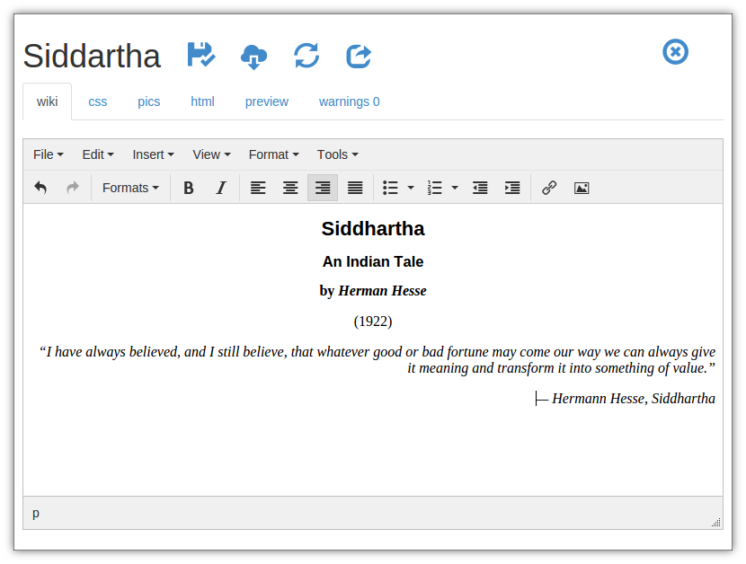

# Kindle Forge

A portable Kindle ebook editor written with JavaScript, [Node.js](https://nodejs.org), [Electron](http://electron.atom.io), [Express](http://expressjs.com), [Browserify](http://browserify.org/).

## How To Use
- Create a new project
- Edit content
- Add images
- Click save button
- Click download button
- Save .zip file
- Upload .zip file to your https://kdp.amazon.com to preview/create ebooks for Kindle!

## Highlights
- Single page app
- Simple wiki-like language implemented in JavaScript
- Kindle-friendly TOC generation
- Ebook preview
- Ebook HTML code preview 
- Can upload and manage images
- Kindle-optimized image positioning
- Kindle-optimized generated HTML/CSS 
- Friendly wiki syntax error reporting
- Checks for manually updated .html file

## Libs Used
- Node.js
- Express
- Electron
- Browserify
- Boostrap
- jQuery
- ESLint